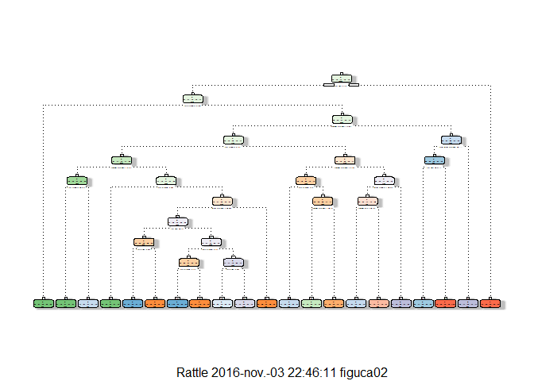

# Machine Learning - Peer Assesment
Carlos Figueroa  
31 de octubre de 2016  
  
##Intro
  
The main idea is to predict the activitie that is being performed bya  group of people by using the data provided by activity monitors

## Main Procedure

Lets start by setting the working directory, loading the data, preeeliminar analysis, etc.


```r
library(knitr)
library(caret)
library(e1071)
library(rpart)
library(rattle)
library(rpart.plot)
```


```r
setwd("C:\\Users\\figuca02\\datasciencecoursera\\Machine_Learning_Submission")
training<-read.csv("pml-training.csv")
testing<-read.csv("pml-testing.csv")
```

Creating partition and the subsequent training and testing sets:
  

```r
inTrain <-createDataPartition(training$classe, p=0.7, list=FALSE)
trainset<-training[inTrain, ]
testset<-training[-inTrain, ]
```

Seems there are a lot of variables, some useless like identifiers, so in order to take the most relevant ones I will remove non zero variance and change NA to 0 and remove the first variables which are only identifiers of time and subjet:
  

```r
trainset[is.na(trainset)]<-0
testset[is.na(testset)]<-0
nonzerovar<-nearZeroVar(trainset)
trainingset<-trainset[,-nonzerovar]
testingset<-testset[,-nonzerovar]
trainingset<-trainingset[,-(1:5)]
testingset<-testingset[,-(1:5)]
names(trainingset)
```

```
##  [1] "num_window"           "roll_belt"            "pitch_belt"          
##  [4] "yaw_belt"             "total_accel_belt"     "gyros_belt_x"        
##  [7] "gyros_belt_y"         "gyros_belt_z"         "accel_belt_x"        
## [10] "accel_belt_y"         "accel_belt_z"         "magnet_belt_x"       
## [13] "magnet_belt_y"        "magnet_belt_z"        "roll_arm"            
## [16] "pitch_arm"            "yaw_arm"              "total_accel_arm"     
## [19] "gyros_arm_x"          "gyros_arm_y"          "gyros_arm_z"         
## [22] "accel_arm_x"          "accel_arm_y"          "accel_arm_z"         
## [25] "magnet_arm_x"         "magnet_arm_y"         "magnet_arm_z"        
## [28] "roll_dumbbell"        "pitch_dumbbell"       "yaw_dumbbell"        
## [31] "total_accel_dumbbell" "gyros_dumbbell_x"     "gyros_dumbbell_y"    
## [34] "gyros_dumbbell_z"     "accel_dumbbell_x"     "accel_dumbbell_y"    
## [37] "accel_dumbbell_z"     "magnet_dumbbell_x"    "magnet_dumbbell_y"   
## [40] "magnet_dumbbell_z"    "roll_forearm"         "pitch_forearm"       
## [43] "yaw_forearm"          "total_accel_forearm"  "gyros_forearm_x"     
## [46] "gyros_forearm_y"      "gyros_forearm_z"      "accel_forearm_x"     
## [49] "accel_forearm_y"      "accel_forearm_z"      "magnet_forearm_x"    
## [52] "magnet_forearm_y"     "magnet_forearm_z"     "classe"
```

```r
names(testingset)
```

```
##  [1] "num_window"           "roll_belt"            "pitch_belt"          
##  [4] "yaw_belt"             "total_accel_belt"     "gyros_belt_x"        
##  [7] "gyros_belt_y"         "gyros_belt_z"         "accel_belt_x"        
## [10] "accel_belt_y"         "accel_belt_z"         "magnet_belt_x"       
## [13] "magnet_belt_y"        "magnet_belt_z"        "roll_arm"            
## [16] "pitch_arm"            "yaw_arm"              "total_accel_arm"     
## [19] "gyros_arm_x"          "gyros_arm_y"          "gyros_arm_z"         
## [22] "accel_arm_x"          "accel_arm_y"          "accel_arm_z"         
## [25] "magnet_arm_x"         "magnet_arm_y"         "magnet_arm_z"        
## [28] "roll_dumbbell"        "pitch_dumbbell"       "yaw_dumbbell"        
## [31] "total_accel_dumbbell" "gyros_dumbbell_x"     "gyros_dumbbell_y"    
## [34] "gyros_dumbbell_z"     "accel_dumbbell_x"     "accel_dumbbell_y"    
## [37] "accel_dumbbell_z"     "magnet_dumbbell_x"    "magnet_dumbbell_y"   
## [40] "magnet_dumbbell_z"    "roll_forearm"         "pitch_forearm"       
## [43] "yaw_forearm"          "total_accel_forearm"  "gyros_forearm_x"     
## [46] "gyros_forearm_y"      "gyros_forearm_z"      "accel_forearm_x"     
## [49] "accel_forearm_y"      "accel_forearm_z"      "magnet_forearm_x"    
## [52] "magnet_forearm_y"     "magnet_forearm_z"     "classe"
```


## Prediction

Now, with the remaining 54 variables I will try a simple classification tree prediction:
  

```r
set.seed(1234)
modelfit<-rpart(classe~., data=trainingset, method="class")
fancyRpartPlot(modelfit)
```




Predicting on the training dataset:
  

```r
set.seed(1234)
predictmodelfit<-predict(modelfit, data=trainingset, type="class")
confusionMatrix(predictmodelfit,trainingset$classe)
```

```
## Confusion Matrix and Statistics
## 
##           Reference
## Prediction    A    B    C    D    E
##          A 3450  323   96  102   24
##          B  115 1589  110   48   56
##          C  183  370 2121  412  193
##          D  127  288   43 1422  174
##          E   31   88   26  268 2078
## 
## Overall Statistics
##                                          
##                Accuracy : 0.776          
##                  95% CI : (0.7689, 0.783)
##     No Information Rate : 0.2843         
##     P-Value [Acc > NIR] : < 2.2e-16      
##                                          
##                   Kappa : 0.7168         
##  Mcnemar's Test P-Value : < 2.2e-16      
## 
## Statistics by Class:
## 
##                      Class: A Class: B Class: C Class: D Class: E
## Sensitivity            0.8833   0.5978   0.8852   0.6314   0.8230
## Specificity            0.9446   0.9703   0.8979   0.9450   0.9632
## Pos Pred Value         0.8636   0.8285   0.6468   0.6923   0.8342
## Neg Pred Value         0.9532   0.9096   0.9737   0.9290   0.9603
## Prevalence             0.2843   0.1935   0.1744   0.1639   0.1838
## Detection Rate         0.2511   0.1157   0.1544   0.1035   0.1513
## Detection Prevalence   0.2908   0.1396   0.2387   0.1495   0.1813
## Balanced Accuracy      0.9139   0.7841   0.8916   0.7882   0.8931
```


Predicting on the test set:
  

```r
set.seed(1234)
predicttest<-predict(modelfit, newdata=testingset, type="class")
confusionMatrix(predicttest, testingset$classe)
```

```
## Confusion Matrix and Statistics
## 
##           Reference
## Prediction    A    B    C    D    E
##          A 1464  167   43   45   14
##          B   61  647   36   23   21
##          C   83  156  918  210   85
##          D   51  136   16  573   72
##          E   15   33   13  113  890
## 
## Overall Statistics
##                                           
##                Accuracy : 0.7633          
##                  95% CI : (0.7522, 0.7741)
##     No Information Rate : 0.2845          
##     P-Value [Acc > NIR] : < 2.2e-16       
##                                           
##                   Kappa : 0.7005          
##  Mcnemar's Test P-Value : < 2.2e-16       
## 
## Statistics by Class:
## 
##                      Class: A Class: B Class: C Class: D Class: E
## Sensitivity            0.8746   0.5680   0.8947  0.59440   0.8226
## Specificity            0.9361   0.9703   0.8901  0.94412   0.9638
## Pos Pred Value         0.8448   0.8211   0.6322  0.67571   0.8365
## Neg Pred Value         0.9494   0.9035   0.9756  0.92237   0.9602
## Prevalence             0.2845   0.1935   0.1743  0.16381   0.1839
## Detection Rate         0.2488   0.1099   0.1560  0.09737   0.1512
## Detection Prevalence   0.2945   0.1339   0.2467  0.14410   0.1808
## Balanced Accuracy      0.9053   0.7692   0.8924  0.76926   0.8932
```


Now, for the test:
  

```r
set.seed(1234)
predictnewtest<-predict(modelfit, newdata=testing)
predictnewtest
```

```
##              A           B          C          D          E
## 1  0.000000000 1.000000000 0.00000000 0.00000000 0.00000000
## 2  0.652624757 0.203499676 0.06221646 0.06610499 0.01555412
## 3  0.178631052 0.275459098 0.31051753 0.08013356 0.15525876
## 4  1.000000000 0.000000000 0.00000000 0.00000000 0.00000000
## 5  1.000000000 0.000000000 0.00000000 0.00000000 0.00000000
## 6  0.025326170 0.042210284 0.63699156 0.22716807 0.06830391
## 7  0.124000000 0.164000000 0.03500000 0.63700000 0.04000000
## 8  0.124000000 0.164000000 0.03500000 0.63700000 0.04000000
## 9  0.991964286 0.008035714 0.00000000 0.00000000 0.00000000
## 10 0.652624757 0.203499676 0.06221646 0.06610499 0.01555412
## 11 0.025326170 0.042210284 0.63699156 0.22716807 0.06830391
## 12 0.178631052 0.275459098 0.31051753 0.08013356 0.15525876
## 13 0.007792208 0.194805195 0.06753247 0.23116883 0.49870130
## 14 0.991964286 0.008035714 0.00000000 0.00000000 0.00000000
## 15 0.043103448 0.037356322 0.00000000 0.24137931 0.67816092
## 16 0.043103448 0.037356322 0.00000000 0.24137931 0.67816092
## 17 1.000000000 0.000000000 0.00000000 0.00000000 0.00000000
## 18 0.652624757 0.203499676 0.06221646 0.06610499 0.01555412
## 19 0.000000000 1.000000000 0.00000000 0.00000000 0.00000000
## 20 0.077702703 0.824324324 0.01013514 0.05067568 0.03716216
```
