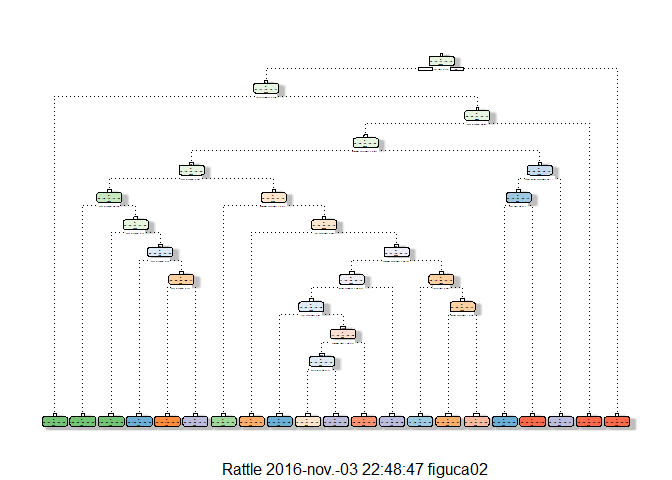

# Machine Learning - Peer Assesment
Carlos Figueroa  
31 de octubre de 2016  
  
##Intro
  
The main idea is to predict the activitie that is being performed bya  group of people by using the data provided by activity monitors

## Main Procedure

Lets start by setting the working directory, loading the data, preeeliminar analysis, etc.


```r
library(knitr)
library(caret)
library(e1071)
library(rpart)
library(rattle)
library(rpart.plot)
```


```r
setwd("C:\\Users\\figuca02\\datasciencecoursera\\Machine_Learning_Submission")
training<-read.csv("pml-training.csv")
testing<-read.csv("pml-testing.csv")
```

Creating partition and the subsequent training and testing sets:
  

```r
inTrain <-createDataPartition(training$classe, p=0.7, list=FALSE)
trainset<-training[inTrain, ]
testset<-training[-inTrain, ]
```

Seems there are a lot of variables, some useless like identifiers, so in order to take the most relevant ones I will remove non zero variance and change NA to 0 and remove the first variables which are only identifiers of time and subjet:
  

```r
trainset[is.na(trainset)]<-0
testset[is.na(testset)]<-0
nonzerovar<-nearZeroVar(trainset)
trainingset<-trainset[,-nonzerovar]
testingset<-testset[,-nonzerovar]
trainingset<-trainingset[,-(1:5)]
testingset<-testingset[,-(1:5)]
names(trainingset)
```

```
##  [1] "num_window"           "roll_belt"            "pitch_belt"          
##  [4] "yaw_belt"             "total_accel_belt"     "gyros_belt_x"        
##  [7] "gyros_belt_y"         "gyros_belt_z"         "accel_belt_x"        
## [10] "accel_belt_y"         "accel_belt_z"         "magnet_belt_x"       
## [13] "magnet_belt_y"        "magnet_belt_z"        "roll_arm"            
## [16] "pitch_arm"            "yaw_arm"              "total_accel_arm"     
## [19] "gyros_arm_x"          "gyros_arm_y"          "gyros_arm_z"         
## [22] "accel_arm_x"          "accel_arm_y"          "accel_arm_z"         
## [25] "magnet_arm_x"         "magnet_arm_y"         "magnet_arm_z"        
## [28] "roll_dumbbell"        "pitch_dumbbell"       "yaw_dumbbell"        
## [31] "total_accel_dumbbell" "gyros_dumbbell_x"     "gyros_dumbbell_y"    
## [34] "gyros_dumbbell_z"     "accel_dumbbell_x"     "accel_dumbbell_y"    
## [37] "accel_dumbbell_z"     "magnet_dumbbell_x"    "magnet_dumbbell_y"   
## [40] "magnet_dumbbell_z"    "roll_forearm"         "pitch_forearm"       
## [43] "yaw_forearm"          "total_accel_forearm"  "gyros_forearm_x"     
## [46] "gyros_forearm_y"      "gyros_forearm_z"      "accel_forearm_x"     
## [49] "accel_forearm_y"      "accel_forearm_z"      "magnet_forearm_x"    
## [52] "magnet_forearm_y"     "magnet_forearm_z"     "classe"
```

```r
names(testingset)
```

```
##  [1] "num_window"           "roll_belt"            "pitch_belt"          
##  [4] "yaw_belt"             "total_accel_belt"     "gyros_belt_x"        
##  [7] "gyros_belt_y"         "gyros_belt_z"         "accel_belt_x"        
## [10] "accel_belt_y"         "accel_belt_z"         "magnet_belt_x"       
## [13] "magnet_belt_y"        "magnet_belt_z"        "roll_arm"            
## [16] "pitch_arm"            "yaw_arm"              "total_accel_arm"     
## [19] "gyros_arm_x"          "gyros_arm_y"          "gyros_arm_z"         
## [22] "accel_arm_x"          "accel_arm_y"          "accel_arm_z"         
## [25] "magnet_arm_x"         "magnet_arm_y"         "magnet_arm_z"        
## [28] "roll_dumbbell"        "pitch_dumbbell"       "yaw_dumbbell"        
## [31] "total_accel_dumbbell" "gyros_dumbbell_x"     "gyros_dumbbell_y"    
## [34] "gyros_dumbbell_z"     "accel_dumbbell_x"     "accel_dumbbell_y"    
## [37] "accel_dumbbell_z"     "magnet_dumbbell_x"    "magnet_dumbbell_y"   
## [40] "magnet_dumbbell_z"    "roll_forearm"         "pitch_forearm"       
## [43] "yaw_forearm"          "total_accel_forearm"  "gyros_forearm_x"     
## [46] "gyros_forearm_y"      "gyros_forearm_z"      "accel_forearm_x"     
## [49] "accel_forearm_y"      "accel_forearm_z"      "magnet_forearm_x"    
## [52] "magnet_forearm_y"     "magnet_forearm_z"     "classe"
```


## Prediction

Now, with the remaining 54 variables I will try a simple classification tree prediction:
  

```r
set.seed(1234)
modelfit<-rpart(classe~., data=trainingset, method="class")
fancyRpartPlot(modelfit)
```




Predicting on the training dataset:
  

```r
set.seed(1234)
predictmodelfit<-predict(modelfit, data=trainingset, type="class")
confusionMatrix(predictmodelfit,trainingset$classe)
```

```
## Confusion Matrix and Statistics
## 
##           Reference
## Prediction    A    B    C    D    E
##          A 3357  299   40  114  170
##          B  264 1775  229  212  267
##          C   20  160 1923  337  145
##          D  217  343  138 1509  311
##          E   48   81   66   80 1632
## 
## Overall Statistics
##                                           
##                Accuracy : 0.7422          
##                  95% CI : (0.7348, 0.7495)
##     No Information Rate : 0.2843          
##     P-Value [Acc > NIR] : < 2.2e-16       
##                                           
##                   Kappa : 0.6739          
##  Mcnemar's Test P-Value : < 2.2e-16       
## 
## Statistics by Class:
## 
##                      Class: A Class: B Class: C Class: D Class: E
## Sensitivity            0.8594   0.6678   0.8026   0.6701   0.6463
## Specificity            0.9366   0.9123   0.9416   0.9121   0.9755
## Pos Pred Value         0.8435   0.6462   0.7439   0.5993   0.8558
## Neg Pred Value         0.9437   0.9197   0.9576   0.9338   0.9245
## Prevalence             0.2843   0.1935   0.1744   0.1639   0.1838
## Detection Rate         0.2444   0.1292   0.1400   0.1098   0.1188
## Detection Prevalence   0.2897   0.2000   0.1882   0.1833   0.1388
## Balanced Accuracy      0.8980   0.7900   0.8721   0.7911   0.8109
```


Predicting on the test set:
  

```r
set.seed(1234)
predicttest<-predict(modelfit, newdata=testingset, type="class")
confusionMatrix(predicttest, testingset$classe)
```

```
## Confusion Matrix and Statistics
## 
##           Reference
## Prediction    A    B    C    D    E
##          A 1407  143   14   33   69
##          B  142  773  103  103  135
##          C   11   58  828  139   70
##          D   86  135   58  646  134
##          E   28   30   23   43  674
## 
## Overall Statistics
##                                          
##                Accuracy : 0.7354         
##                  95% CI : (0.724, 0.7467)
##     No Information Rate : 0.2845         
##     P-Value [Acc > NIR] : < 2.2e-16      
##                                          
##                   Kappa : 0.6655         
##  Mcnemar's Test P-Value : < 2.2e-16      
## 
## Statistics by Class:
## 
##                      Class: A Class: B Class: C Class: D Class: E
## Sensitivity            0.8405   0.6787   0.8070   0.6701   0.6229
## Specificity            0.9385   0.8982   0.9428   0.9161   0.9742
## Pos Pred Value         0.8445   0.6154   0.7486   0.6100   0.8446
## Neg Pred Value         0.9367   0.9209   0.9586   0.9341   0.9198
## Prevalence             0.2845   0.1935   0.1743   0.1638   0.1839
## Detection Rate         0.2391   0.1314   0.1407   0.1098   0.1145
## Detection Prevalence   0.2831   0.2134   0.1879   0.1799   0.1356
## Balanced Accuracy      0.8895   0.7884   0.8749   0.7931   0.7986
```


Now, for the test:
  

```r
set.seed(1234)
predictnewtest<-predict(modelfit, newdata=testing)
predictnewtest
```

```
##             A          B           C          D           E
## 1  0.10894942 0.57976654 0.000000000 0.00000000 0.311284047
## 2  0.81092695 0.15469613 0.014732965 0.01289134 0.006752609
## 3  0.02156334 0.56603774 0.231805930 0.08086253 0.099730458
## 4  0.83137673 0.00000000 0.000000000 0.06616862 0.102454642
## 5  0.83137673 0.00000000 0.000000000 0.06616862 0.102454642
## 6  0.01220256 0.07870653 0.632092739 0.18852959 0.088468578
## 7  0.06951027 0.13902054 0.039494471 0.67298578 0.078988942
## 8  0.12481962 0.12409812 0.080086580 0.52308802 0.147907648
## 9  0.99365942 0.00634058 0.000000000 0.00000000 0.000000000
## 10 0.81092695 0.15469613 0.014732965 0.01289134 0.006752609
## 11 0.01220256 0.07870653 0.632092739 0.18852959 0.088468578
## 12 0.02156334 0.56603774 0.231805930 0.08086253 0.099730458
## 13 0.51612903 0.12903226 0.051612903 0.10000000 0.203225806
## 14 0.99365942 0.00634058 0.000000000 0.00000000 0.000000000
## 15 0.07222222 0.15000000 0.122222222 0.14814815 0.507407407
## 16 0.12481962 0.12409812 0.080086580 0.52308802 0.147907648
## 17 0.83137673 0.00000000 0.000000000 0.06616862 0.102454642
## 18 0.11144578 0.40963855 0.009036145 0.31325301 0.156626506
## 19 0.11144578 0.40963855 0.009036145 0.31325301 0.156626506
## 20 0.02156334 0.56603774 0.231805930 0.08086253 0.099730458
```
